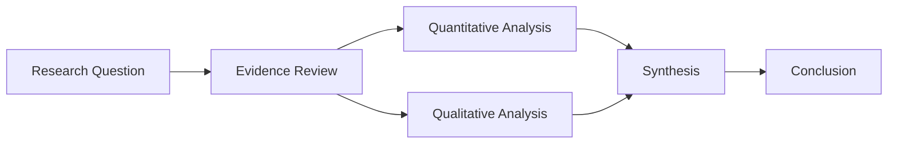

# Visual Elements Guide

Detailed guidance for creating analytical visuals in research reports.

## Table of Contents

1. [Financial Tables](#financial-tables)
2. [Charts and Trend Visualizations](#charts-and-trend-visualizations)
3. [Framework Diagrams](#framework-diagrams)
4. [Comparison Matrices](#comparison-matrices)
5. [Risk Tables](#risk-tables)
6. [Mermaid Diagrams](#mermaid-diagrams)
7. [Generated Infographics](#generated-infographics)
8. [Visual Mix Target](#visual-mix-target)
9. [PDF Embedding Notes](#pdf-embedding-notes)

---

## Financial Tables

### Purpose
Present numerical data in structured, scannable format.

### Structure
```
| Metric | 2022 | 2023 | 2024E | 2025E |
|--------|------|------|-------|-------|
| Revenue ($M) | 1,234 | 1,456 | 1,678 | 1,890 |
| Growth (%) | -- | 18.0% | 15.2% | 12.6% |
| Gross Margin | 42.1% | 43.5% | 44.0% | 45.0% |
```

### Best Practices

- Right-align numbers for easy comparison.
- Use consistent decimal places within columns.
- Highlight key metrics with accent color or bold formatting.
- Include units in column headers or first row.
- Add YoY or CAGR calculations for trend clarity.
- For final PDFs, prefer LaTeX table environments such as `tabularx`, `longtable`, and `booktabs` styling.

### Caption Format
"Table: [Subject] key metrics overview (FY2022-2025E)"

---

## Charts and Trend Visualizations

### Purpose
Show patterns, trends, and relationships over time or across categories.

### Types

#### Line Charts
- Best for: Time-series data, trends
- Describe: "Revenue trajectory showing 15% CAGR from 2020-2024"

#### Bar Charts
- Best for: Comparing discrete categories
- Describe: "Market share by segment, with Product A at 34%"

#### Stacked Bars
- Best for: Composition changes over time
- Describe: "Revenue mix shift from Hardware (60%→40%) to Services (40%→60%)"

### Textual Description Format
When charts are described textually:
```
Figure: Revenue growth trajectory
┌────────────────────────────────────┐
│                          ╭──────╮  │
│                    ╭─────╯ 2024 │  │
│              ╭─────╯            │  │
│        ╭─────╯ 2023             │  │
│  ╭─────╯                        │  │
│──╯ 2020   2021   2022          ╰──│
│  $1.0B   $1.2B   $1.5B   $1.8B   │
└────────────────────────────────────┘
Key: Consistent 20%+ annual growth
```

### Caption Format
"Figure: [Metric name] [time period/context]"

---

## Framework Diagrams

### Purpose
Illustrate structures, processes, or conceptual relationships.

### Business Structure Diagram
```
┌─────────────────────────────────────────────────┐
│                  COMPANY STRUCTURE              │
├─────────────────┬───────────────────────────────┤
│   SEGMENT A     │        SEGMENT B              │
│   (60% Rev)     │        (40% Rev)              │
├─────────────────┼───────────────────────────────┤
│ • Product 1     │ • Service 1                   │
│ • Product 2     │ • Service 2                   │
│ • Product 3     │ • Subscription Model          │
└─────────────────┴───────────────────────────────┘
```

### Process Flow Diagram
```
[Input] → [Process A] → [Process B] → [Output]
              ↓
         [Feedback Loop]
```

### Caption Format
"Figure: [Entity/Subject] [structure/process] overview"

---

## Comparison Matrices

### Purpose
Enable side-by-side evaluation across multiple dimensions.

### Competitive Positioning Matrix
```
┌──────────────────┬─────────┬─────────┬─────────┬─────────┐
│     Dimension    │ Co. A   │ Co. B   │ Co. C   │ Target  │
├──────────────────┼─────────┼─────────┼─────────┼─────────┤
│ Market Share     │ 25%     │ 20%     │ 15%     │ 12%     │
│ Revenue Growth   │ High    │ Med     │ Low     │ High    │
│ Margin Profile   │ 35%     │ 28%     │ 42%     │ 30%     │
│ R&D Investment   │ 15%     │ 12%     │ 8%      │ 18%     │
└──────────────────┴─────────┴─────────┴─────────┴─────────┘
```

### Scoring Matrix
Use consistent scale (1-5, Low/Med/High) for subjective assessments:
```
| Factor         | Co. A | Co. B | Co. C |
|----------------|-------|-------|-------|
| Brand Strength | ●●●●○ | ●●●○○ | ●●○○○ |
| Distribution   | ●●●●● | ●●●○○ | ●●●●○ |
| Technology     | ●●●○○ | ●●●●○ | ●●○○○ |
```

### Caption Format
"Table: Competitive positioning comparison" or "Table: [Subject] comparison matrix"

---

## Risk Tables

### Purpose
Structure risk assessment with probability and impact categories.

### Structure
```
┌─────────────────────┬────────────┬────────┬──────────────────┐
│       Risk          │ Probability│ Impact │   Mitigation     │
├─────────────────────┼────────────┼────────┼──────────────────┤
│ Market downturn     │ Medium     │ High   │ Diversification  │
│ Regulatory change   │ Low        │ Medium │ Compliance team  │
│ Competition         │ High       │ Medium │ R&D investment   │
│ Supply disruption   │ Low        │ High   │ Multi-sourcing   │
└─────────────────────┴────────────┴────────┴──────────────────┘
```

### Probability Scale
- **High**: >50% likelihood within forecast period
- **Medium**: 20-50% likelihood
- **Low**: <20% likelihood

### Impact Scale
- **High**: Material effect on thesis (>10% valuation impact)
- **Medium**: Moderate effect (5-10% valuation impact)
- **Low**: Minor effect (<5% valuation impact)

### Caption Format
"Table: Key risk factors and assessment"

---

## Mermaid Diagrams

### Purpose
Use Mermaid for structured, high-clarity analytical diagrams that should remain editable and easy to regenerate.

### Best Use Cases
- Operating model and workflow diagrams
- Value-chain maps
- Market structure and ecosystem diagrams
- Decision trees
- Dependency maps
- Scenario logic and thesis trees

### Example


### Best Practices
- Keep node labels short and analytical.
- Use the report color palette where rendering allows.
- Prefer left-to-right or top-to-bottom layouts with clear reading order.
- Avoid excessive branching unless the diagram truly requires it.
- Convert finalized Mermaid output to SVG first, then to PDF for LaTeX embedding if needed.

### Caption Format
"Figure: Research workflow and synthesis process"

---

## Generated Infographics

### Purpose
Use generated infographics or editorial visuals when a custom image will communicate context faster than text alone.

### Best Use Cases
- Ecosystem overviews
- Timeline visuals
- Section-leading summary graphics
- Market landscape illustrations
- Conceptual operating-model visuals

### Style Guidance
- Use a clean editorial or presentation-ready style.
- Prefer white or very light backgrounds.
- Keep labels restrained and readable.
- Match the core palette: primary blue, secondary blue, accent gold, neutral body text.
- Avoid decorative clutter or overly playful styling.
- Make sure the image supports analysis rather than replacing it.

### Prompt Guidance
When generating an infographic, specify:
- subject and analytical purpose
- composition and orientation
- desired visual hierarchy
- report color palette
- level of detail and labeling
- print-friendly, professional styling

### Caption Format
"Figure: Market ecosystem overview" or "Figure: Operating model summary infographic"

---

## Visual Mix Target

Unless the user requests otherwise, target a roughly **4:6 diagram/image-to-text ratio** across the report.

Practical interpretation:
- About **40% visual content** and **60% text**.
- Most major sections should contain at least one meaningful visual.
- Use a mix of tables, Mermaid diagrams, and generated infographics.
- Do not force visuals where they add no analytical value.

---

## PDF Embedding Notes

For final PDF production, prefer a **manual XeLaTeX workflow**.

### Recommended Approach
1. Create Mermaid source.
2. Render Mermaid to SVG.
3. Convert SVG to PDF when direct SVG inclusion is not reliable.
4. Embed vector diagrams with `\includegraphics`.
5. Use explicit LaTeX table environments for dense analytical tables.
6. Compile with XeLaTeX twice before review.

### Reliability Guidance
- Favor widely available LaTeX packages and fonts.
- If optional packages are missing, simplify styling rather than abandoning the manual LaTeX method.
- Keep generated images at print-safe resolution and size them deliberately.
- Preserve vector artwork wherever possible.

---

## Visual Design Principles

### Information Density
- Aim for maximum information per visual element.
- Avoid decoration that doesn't serve analysis.
- Every element should earn its place.

### Consistency
- Use consistent formatting across similar visual types.
- Maintain alignment and spacing standards.
- Apply color system uniformly.

### Scannability
- Design for quick comprehension.
- Lead with most important information.
- Use visual hierarchy (bold, color, size).
